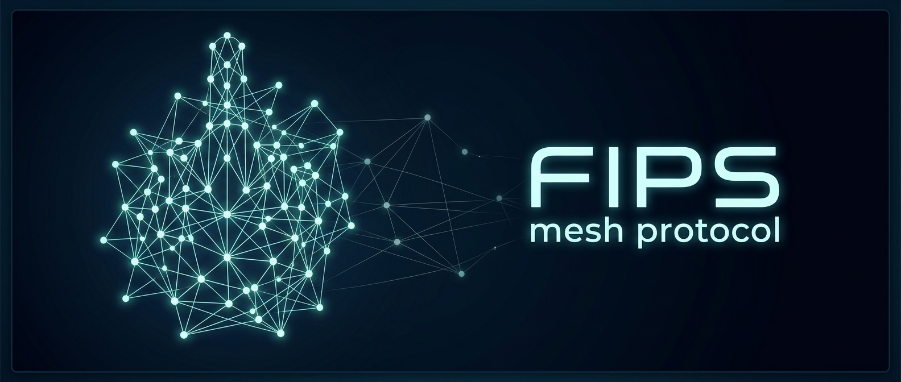

# FIPS: Free Internetworking Peering System


[](LICENSE)
[](https://www.rust-lang.org/)
[](#status--roadmap)

A self-organizing encrypted mesh network built on Nostr identities,
capable of operating over arbitrary transports without central
infrastructure.

> FIPS is under active development. The protocol and APIs are not
> yet stable. See [Status & roadmap](#status--roadmap) below.

## What FIPS does

A machine running FIPS becomes a node in the mesh with a self-generated
cryptographic identity, tunneling existing IPv6 traffic over the mesh
or bypassing IP altogether and letting natively written applications
communicate directly with each other. In either case all traffic between
nodes is end-to-end encrypted and authenticated.

The mesh is self-organizing and permissionless. Any node can join and reach
any other node without a central address registry, routing configuration, or
coordination server. Peering between nodes can be manually configured or
use auto-discovery.

There are two equally-supported deployment modes.

**As an overlay** on top of existing IP networks, FIPS lets your node reach
any other FIPS node wherever it sits: behind a NAT, on a different ISP, on a
phone over cellular, on a laptop with only Bluetooth in range, or behind a
Tor onion.

**Ground up** over raw Ethernet, WiFi, or Bluetooth, FIPS provides a
complete permissionless network without any pre-existing IP infrastructure,
ISP, or DNS. Any node that joins the link gets routable IPv6 addresses, peer
discovery, and a path to every other node automatically. Support exists in
OpenWrt for turning a router radio into a backhaul link and for creating an
open access SSID so a phone or laptop can join without any configuration.

Either way, existing networking software runs over it unchanged — SSH, HTTP
servers, file transfer, anything IPv6-native works the same way it would on
a local network. Applications written to the FIPS native API skip that
layer entirely and address each other by public key, with no IPv6
emulation.

## Features

### The mesh

- **Self-organizing mesh routing.** Spanning-tree coordinates with
  bloom-filter-guided discovery; no global routing tables, no
  flooding.
- **Multi-transport.** UDP, TCP, Ethernet, Tor, Nym, and Bluetooth
  (BLE L2CAP) ship today; transports compose on a single mesh and a
  node may run several at once.
- **Self-assigned cryptographic identity.** secp256k1 / schnorr
  keypairs as node addresses; no registration, no central authority.
- **Two-layer encryption.** Noise IK between peers (hop-by-hop) and
  Noise XK between mesh endpoints (independent end-to-end), with
  periodic rekey for forward secrecy.
- **(Optional) Nostr-mediated discovery and NAT traversal.** Peers may
  publish endpoint adverts on public Nostr relays, exchange peering
  candidates, and establish direct paths through NATs using
  STUN-assisted hole punching. On the local network, mDNS LAN discovery
  finds peers directly without relays.

### Getting traffic onto it

- **IPv6 adapter.** A TUN interface maps each remote npub to an
  `fd00::/8` address, so unmodified IPv6 software reaches mesh
  peers as `<npub>.fips`. Built-in `.fips` DNS resolver, with
  optional static name mapping via `/etc/fips/hosts`.
- **Native datagram API.** A local program moves bytes between two
  public keys over the mesh, addressing a peer as `npub:port` with no
  IPv6 emulation and no TUN device in the path. `connect` and `bind`
  take a key and a port, and from there it is ordinary socket calls.
- **LAN gateway.** Optional `fips-gateway` service folds an entire
  unmodified LAN into the mesh: outbound (LAN clients reach mesh
  destinations through a DNS-allocated virtual IPv6 pool and
  nftables NAT) and inbound (LAN-side services exposed to the mesh
  through 1:1 port forwards).
- **OpenWrt support.** FIPS ships as an OpenWrt package. Routers run
  802.11s between themselves as a bare L2 link, with FIPS supplying the
  encryption, authentication and routing over it. A second helper brings
  up an open `!FIPS` SSID, the same on every router, which a FIPS client
  joins over WiFi without configuration.

### Running a node

- **Operator visibility.** `fipsctl` CLI for control and inspection
  with time-series stats history queryable for any metric,
  `fipstop` TUI for live status with inline sparkline dashboards,
  and a JSON-line control socket on each binary for direct
  programmatic access.
- **Per-link metrics.** RTT, loss, jitter, and goodput on every
  hop, plus mesh-size estimation, via the Metrics Measurement
  Protocol.
- **ECN congestion signaling.** Hop-by-hop CE-flag relay with RFC
  3168 IPv6 marking and transport kernel-drop detection.
- **Mesh-interface security baseline.** Optional default-deny
  nftables policy for `fips0` shipped as a packaged conffile
  (`/etc/fips/fips.nft`) with an operator drop-in directory
  (`/etc/fips/fips.d/`) and a disabled-by-default
  `fips-firewall.service`. The baseline polices only the mesh
  interface, leaving Docker, Tor, and the host firewall untouched.
- **Reproducible builds** with toolchain pinning and
  `SOURCE_DATE_EPOCH`.

## Quick start

**Start from a released package.** Every packaged platform in the table
below gets an installer built and published per release, with checksums,
on the [releases page](https://github.com/jmcorgan/fips/releases/latest).
Building from source produces the same artifacts and the same
post-install state, so it is the path to take when you want to modify
FIPS rather than run it.

On Debian or Ubuntu, download `fips_<version>_amd64.deb` (or
`_arm64.deb`) and install it:

```bash
sudo apt install ./fips_<version>_amd64.deb
sudo systemctl start fips fips-dns
```

This installs the daemon, CLI tools (`fipsctl`, `fipstop`), the
`fips-dns` service that wires `.fips` name resolution into the host
resolver, the optional `fips-gateway` service, systemd units, and a
default `/etc/fips/fips.yaml` you can edit before starting. The package
enables `fips` and `fips-dns` but starts neither, which is why the
second command is there.

For macOS, Windows, FreeBSD, OpenWrt, the systemd tarball or a Nix
flake, [packaging/README.md](packaging/README.md) gives the install
commands for each package format, and
[docs/getting-started.md](docs/getting-started.md) is the full
multi-platform installation guide.

To join a live mesh and reach your first peer, follow the new-user
tutorial progression starting at
[docs/tutorials/join-the-test-mesh.md](docs/tutorials/join-the-test-mesh.md).

### Building from source

To build the Debian package yourself rather than downloading it:

```bash
git clone https://github.com/jmcorgan/fips.git
cd fips
cargo install cargo-deb
cargo deb
sudo apt install ./target/debian/fips_*.deb
```

For the binaries alone, without an installer:

```bash
cargo build --release
```

Requires Rust 1.94.1+ (edition 2024). Linux, macOS, FreeBSD, and Windows
run as standalone daemons. FreeBSD is packaged for **x86_64 only**;
no aarch64 FreeBSD artifact is built or tested. Android is supported as
an **embedded crate** rather than as a standalone daemon: a
compile-gated library surface where the host app owns the TUN (a
`VpnService`, for example) and reaches the built-in resolver through
`Node::dns_local_addr()`. There is no Android daemon artifact and no
host-app guide. Transport and feature availability varies by platform.

| Feature        | Debian/Ubuntu | Arch | NixOS | macOS  | OpenWrt         | FreeBSD | Android | Windows |
|----------------|:-------------:|:----:|:-----:|:------:|:---------------:|:-------:|:-------:|:-------:|
| UDP            |      ✅       |  ✅  |  ✅   |   ✅   |       ✅        |   ✅    |   ✅    |   ✅    |
| TCP            |      ✅       |  ✅  |  ✅   |   ✅   |       ✅        |   ✅    |   ✅    |   ✅    |
| Tor            |      ✅       |  ✅  |  ✅   |   ✅   |       ✅        |   ✅    |   ❌    |   ✅    |
| Nym            |      ✅       |  ✅  |  ✅   |   ✅   |       ❌        |   ✅    |   ❌    |   ✅    |
| Ethernet       |      ✅       |  ✅  |  ✅   |   ✅   |       ✅        |   ❌    |   ❌    |   ❌    |
| BLE            |      ✅       |  ✅  |  ✅   |   ❌   |       ❌        |   ❌    |   ✅    |   ❌    |
| Native API     |      ✅       |  ✅  |  ✅   |   ✅   |       ✅        |   ✅    |   ❌    |   ❌    |
| Package format |    `.deb`     | AUR  | flake | `.pkg` | `.ipk` / `.apk` | `.pkg`  |   ❌    |   ZIP   |

A column records what builds and runs in a packaged daemon, FreeBSD on
x86_64 only. **Native API** is the native datagram API, which is off by
default; Windows cannot carry it, because it has no `SCM_RIGHTS` with
which to pass a descriptor. **Package format** names the artifact you install,
and a ❌ there means the platform ships none. Windows is the odd one:
its ZIP is an archive you unpack yourself rather than a package an
installer consumes, and there is no MSI.

Five of these columns are Linux: Debian/Ubuntu, Arch, NixOS, OpenWrt
and Android. Linux is not one target. Debian, Ubuntu, Arch and NixOS
are the same glibc build, and what
differs is the packaging: Debian and Ubuntu take the same `.deb`, Arch
takes `fips` from the AUR, and NixOS uses the Nix flake described
below. **Only the `.deb` is exercised by an install test**, by the
`deb-install` suite across debian12, debian13, ubuntu22, ubuntu24 and
ubuntu26; neither the AUR package nor the flake is. That suite runs on
every push and pull request, on x86_64, against a `.deb` built by the same
pinned container as the released one. The arm64 package, built the same way
on an arm64 runner, is installed, its daemon started and the package purged on
ubuntu22 on every push and pull request as well; its upgrade and conffile paths
are not exercised. The suite does not run at a tag: no workflow installs a
published artifact, so the released packages are checked by
hand. OpenWrt is a musl
target rather than glibc, and it takes an `.ipk` on 24.x and earlier or
an `.apk` on 25 and later; both carry the `fips-mesh-setup` and
`fips-ap-setup` helpers.

**Android records what compiles for `aarch64-linux-android` under the
CI cross-check and nothing more**: no transport in that column is
exercised on a device or an emulator, so read it as "compiles", not
"verified here". Being an embedded crate rather than a daemon platform, it
has nothing to
install, which is what its ❌ package format records. The BLE cell is
narrower still: the transport compiles, but the radio behind it is
supplied by the embedding application rather than by FIPS, and no part
of that path is device-tested.

On Linux, a source build requires `libclang` — the LAN gateway's
nftables bindings are generated by `bindgen` at build time, which
needs `libclang.so` on the build host. Install it before building
(`sudo apt install libclang-dev` on Debian / Ubuntu); without it the
build fails inside the `rustables` crate with an "Unable to find
libclang" error. This is a build-time prerequisite only — it is not a
runtime dependency, and the pre-built `.deb` artifacts do not need it.

BLE compiles on every glibc Linux target and on Android, and is
excluded on musl. On glibc Linux, libdbus is a hard build prerequisite
(`sudo apt install libdbus-1-dev pkg-config` on Debian / Ubuntu) —
without it the build fails inside `libdbus-sys` rather than skipping
BLE. The BlueZ daemon itself is a runtime dependency, not a build one.
The OpenWrt ipk is a musl target, so it omits BLE.

Nym (mixnet) transport builds on all desktop platforms. The OpenWrt
❌ is provisional, pending verification of `nym-socks5-client`
availability on the target; it will flip to ✅ only if confirmed
buildable there.

Alternatively, the repo ships a [Nix flake](flake.nix): `nix develop`
drops you into a shell with the pinned toolchain and every build
prerequisite (libclang, dbus, pkg-config) already provided, and
`nix build .#fips` builds all four binaries with no host setup. See the
Nix / NixOS section of [packaging/README.md](packaging/README.md).

## Documentation

`docs/` is organised by reader purpose:

- **[Tutorials](docs/tutorials/)** — hand-held walk-throughs from
  a fresh install through to a participating mesh node, plus
  advanced deployments (gateway on OpenWrt, hosting services,
  ground-up two-device mesh).
- **[How-to guides](docs/how-to/)** — operator recipes for
  specific tasks: firewall activation, Nostr discovery, Tor onion
  service, Bluetooth peering, 802.11s mesh backhaul and the open
  access SSID on OpenWrt, LAN gateway deployment and
  troubleshooting, MTU diagnostics, host aliases, persistent
  identity, unprivileged-user setup, UDP buffer tuning.
- **[Reference](docs/reference/)** — `fips.yaml` configuration,
  wire formats, control-socket protocol, CLI references for each
  binary, security posture matrix, Nostr events catalog, transport
  statistics inventory.
- **[Design](docs/design/)** — protocol-level architecture and
  layer specifications. Start with
  [fips-concepts.md](docs/design/fips-concepts.md) for the framing,
  then [fips-architecture.md](docs/design/fips-architecture.md) for
  the protocol stack.
- **[Release notes](docs/releases/)** — per-version notes, including
  [v0.5.2](docs/releases/release-notes-v0.5.2.md).

If you want to contribute, see [CONTRIBUTING.md](CONTRIBUTING.md)
and [testing/README.md](testing/README.md).

## Examples

- **[examples/sidecar-nostr-relay/](examples/sidecar-nostr-relay/)** —
  Run a [strfry](https://github.com/hoytech/strfry) Nostr relay
  reachable exclusively over the FIPS mesh. The relay container
  shares the FIPS sidecar's network namespace and is isolated from
  the host network.
- **[examples/sidecar-nostr-mixnet-relay/](examples/sidecar-nostr-mixnet-relay/)** —
  Single-container demo of FIPS peering through a **mixnet**
  (implemented with [Nym](https://nym.com/)): the FIPS daemon, the mixnet
  proxy, and a strfry Nostr relay all in one isolated container, with
  the direct route to the peer firewalled off so traffic provably
  crosses the mixnet.
- **[examples/k8s-sidecar/](examples/k8s-sidecar/)** — Run FIPS as
  a Kubernetes Pod sidecar. The sidecar creates `fips0` in the
  Pod's shared network namespace so every other container in the
  Pod gets mesh access without modification.
- **[examples/wireguard-sidecar-macos/](examples/wireguard-sidecar-macos/)** —
  Reach the FIPS mesh from a macOS host through a local Docker
  container over a WireGuard tunnel. Only traffic destined for
  `fd00::/8` transits the sidecar; regular internet traffic
  continues to use the host network.

## Project structure

```text
src/          Rust source: library + fips, fipsctl, fipstop, fips-gateway binaries
docs/         Documentation: tutorials, how-to, reference, design
packaging/    Debian, AUR, systemd tarball, OpenWrt ipk/apk,
              macOS .pkg, FreeBSD .pkg, Windows ZIP
examples/     Deployment examples (Nostr relay, K8s sidecar, macOS WireGuard)
testing/      Docker-based integration test harnesses + chaos simulation
```

## Status & roadmap

FIPS is at **v0.5.2** on the `maint` branch, a maintenance release
that closes security gaps in the Windows service, the gateway and the
rekey handshakes, and fixes the gateway, the Linux, OpenWrt and FreeBSD
packages, and session and discovery recovery after lost messages.
[v0.5.0](https://github.com/jmcorgan/fips/releases/tag/v0.5.0) was the
last feature release, so how much of that release is new to you depends on
which version you are upgrading from. The core
protocol
works end-to-end over UDP, TCP, Ethernet, Tor, Nym, and Bluetooth on a
global, public test mesh of thousands of nodes.

v0.5.2 and v0.5.1 are maintenance releases; the feature content below
is v0.5.0's. v0.5.2 moves the gateway's default DNS port to 5365 and the
Windows config directory to `C:\ProgramData\fips`, and an ephemeral node
no longer writes `fips.key`; see the
[v0.5.2 release notes](docs/releases/release-notes-v0.5.2.md) before
upgrading.

v0.5.0 is a platform-and-lifecycle release. It adds FreeBSD as a
packaged platform (x86_64 only), OpenWrt setup helpers for an 802.11s
mesh between routers (`fips-mesh-setup`) and for the open `!FIPS` client
SSID (`fips-ap-setup`), and an Android embedding interface for apps that own
their own TUN.
Node health is now determined at start completion and published as
`Degraded` or `Failed`, a node with **no transport up is a fatal
start** rather than a silent one, and shutdown runs a bounded drain
window (`node.drain_timeout_secs`, default 2 seconds) so live traffic
is not cut mid-flight. The `node.discovery.*` configuration table
splits into `node.lookup.*` and `node.rendezvous.*`; a deployed
`node.discovery:` block still loads, folded in with a one-time
deprecation warning. New wire-format work continues to be staged on the
`next` branch for the subsequent release line.

### What works today

- Spanning-tree construction with greedy coordinate routing.
- Bloom-filter-guided destination discovery (no flooding,
  single-path with retry).
- Two-layer Noise encryption (IK at the link, XK at the session)
  with periodic hitless rekey for forward secrecy at both layers.
- Persistent or ephemeral node identity with key-file management.
- IPv6 TUN adapter with built-in `.fips` DNS resolver and
  multi-backend auto-configuration (systemd dns-delegate,
  systemd-resolved, dnsmasq, NetworkManager).
- Native datagram API for FIPS-aware applications (npub:port
  addressing without the IPv6-shim path): off by default, with a
  surface that may still change.
- Static hostname mapping (`/etc/fips/hosts`) with auto-reload.
- Per-link metrics (RTT, loss, jitter, goodput) and mesh size
  estimation.
- ECN congestion signaling (hop-by-hop CE relay, IPv6 CE marking,
  kernel-drop detection).
- UDP, TCP, Ethernet, Tor, Nym (mixnet), and BLE transports (BLE
  via L2CAP CoC with per-link MTU negotiation).
- Nostr-mediated overlay endpoint discovery and UDP hole punching
  for NAT traversal, plus mDNS LAN discovery for local peers.
- LAN gateway (`fips-gateway`) with both outbound (LAN-to-mesh)
  and inbound (mesh-to-LAN port-forwarding) modes.
- Peer ACL: per-npub allow / deny admission control at the link
  layer; opt-in mesh-firewall baseline at `fips0` ingress.
- Runtime inspection and peer management via `fipsctl` (including
  `fipsctl probe` for reachability diagnosis and `fipsctl address`
  for mesh-address derivation) and `fipstop`.
- Reproducible builds with toolchain pinning and
  `SOURCE_DATE_EPOCH`.
- Node lifecycle and health reporting (`Starting`, `Running`,
  `Degraded`, `Failed`, `Draining`) with a fatal start when no
  transport comes up and a bounded shutdown drain window.
- OpenWrt setup helpers for an 802.11s mesh between routers
  (`fips-mesh-setup`) and for the open `!FIPS` client SSID
  (`fips-ap-setup`).
- Linux (Debian, systemd tarball, OpenWrt `.ipk` and `.apk`, AUR),
  macOS (`.pkg`), FreeBSD (`.pkg`, x86_64 only), and Windows (ZIP,
  service) packaging.
- Docker-based integration and chaos testing.

### Near-term priorities

- Security audit of the cryptographic protocols.

### Longer-term

- Packaged mobile applications: an Android host app, and iOS. The
  Android embedding interface ships today (see
  [Building from source](#building-from-source)); what is absent is a
  packaged app on either platform.
- Bandwidth-aware routing and QoS.
- Protocol stability and a versioned wire format.
- Published crate.

## License

MIT — see [LICENSE](LICENSE).
